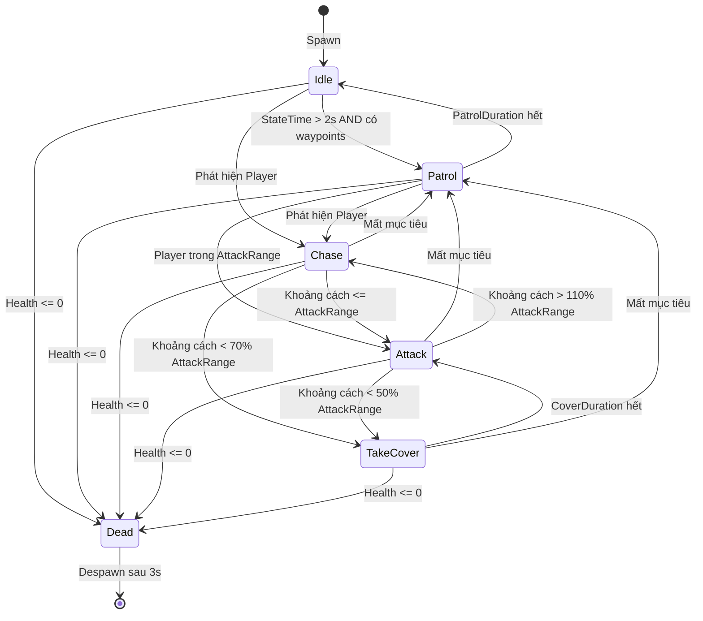

# Báo Cáo Thuật Toán AI và State Machine trong Project Game

## Mục Lục
1. [Tổng Quan Hệ Thống AI](#1-tổng-quan-hệ-thống-ai)
2. [Finite State Machine (FSM)](#2-finite-state-machine-fsm)
3. [Thuật Toán A* Pathfinding](#3-thuật-toán-a-pathfinding)
4. [Hệ Thống Grid-Based Navigation](#4-hệ-thống-grid-based-navigation)
5. [Thuật Toán Vision và Detection](#5-thuật-toán-vision-và-detection)
6. [Thuật Toán Cover Spot Evaluation](#6-thuật-toán-cover-spot-evaluation)
7. [Tích Hợp AI với ECS](#7-tích-hợp-ai-với-ecs)

---

## 1. Tổng Quan Hệ Thống AI

### 1.1. Kiến Trúc Tổng Thể

Hệ thống AI trong project được xây dựng dựa trên ba thành phần chính:

```
┌─────────────────────────────────────────────────────────────────────────┐
│                         ECS AI ARCHITECTURE                             │
├─────────────────────────────────────────────────────────────────────────┤
│                                                                         │
│  ┌─────────────────────┐      ┌─────────────────────┐                  │
│  │  EnemyVisionSystem  │──────│ EnemyPathfindingSystem │               │
│  │  - Phát hiện Player │      │  - Tính toán đường đi  │               │
│  │  - FOV Check        │      │  - A* Algorithm        │               │
│  │  - LOS Raycast      │      │  - Path Smoothing      │               │
│  └─────────────────────┘      └─────────────────────┘                  │
│            │                            │                               │
│            ▼                            ▼                               │
│  ┌─────────────────────────────────────────────────────────────────┐   │
│  │                       EnemyAISystem                              │   │
│  │  - Điều phối State Machine                                       │   │
│  │  - Xử lý Events (PlayerDetected, PlayerLost)                     │   │
│  │  - Gọi OnUpdate() cho state hiện tại                             │   │
│  └─────────────────────────────────────────────────────────────────┘   │
│                                │                                        │
│                                ▼                                        │
│  ┌─────────────────────────────────────────────────────────────────┐   │
│  │                    Finite State Machine                          │   │
│  │  ┌──────┐  ┌────────┐  ┌───────┐  ┌────────┐  ┌──────────────┐  │   │
│  │  │ Idle │──│ Patrol │──│ Chase │──│ Attack │──│  TakeCover   │  │   │
│  │  └──────┘  └────────┘  └───────┘  └────────┘  └──────────────┘  │   │
│  │                                       │                          │   │
│  │                                       ▼                          │   │
│  │                                   ┌──────┐                       │   │
│  │                                   │ Dead │                       │   │
│  │                                   └──────┘                       │   │
│  └─────────────────────────────────────────────────────────────────┘   │
│                                                                         │
└─────────────────────────────────────────────────────────────────────────┘
```

### 1.2. Danh Sách Thuật Toán Được Sử Dụng

| Thuật Toán | Mục Đích | File Implementation |
|------------|----------|---------------------|
| Finite State Machine | Quản lý hành vi AI | `EnemyAIHelpers.cs`, `IEnemyState.cs` |
| A* Pathfinding | Tìm đường đi tối ưu | `AStarPathfinder.cs` |
| Octile Distance Heuristic | Ước lượng khoảng cách 8 hướng | `AStarPathfinder.cs` |
| Path Smoothing (LOS) | Làm mượt đường đi | `AStarPathfinder.cs` |
| BFS Nearest Walkable | Tìm ô đi được gần nhất | `GridSystem.cs` |
| OverlapSphere Detection | Phát hiện Player | `EnemyVisionSystem.cs` |
| Field of View Check | Kiểm tra góc nhìn | `EnemyVisionSystem.cs` |
| Line of Sight Raycast | Kiểm tra tầm nhìn | `EnemyVisionSystem.cs` |
| Weighted Scoring Algorithm | Đánh giá vị trí Cover | `EnemyTakeCoverStateAI.cs` |

---

## 2. Finite State Machine (FSM)

### 2.1. Khái Niệm

**Finite State Machine (FSM)** hay còn gọi là Máy Trạng Thái Hữu Hạn, là một mô hình tính toán mô tả một hệ thống có thể tồn tại trong một số hữu hạn các trạng thái tại bất kỳ thời điểm nào. Hệ thống chỉ có thể ở một trạng thái tại một thời điểm và chuyển đổi giữa các trạng thái dựa trên các điều kiện hoặc sự kiện.

### 2.2. Lý Do Sử Dụng FSM cho Game AI

1. **Dễ hiểu và debug**: Mỗi state có logic riêng biệt, dễ trace behavior
2. **Dễ mở rộng**: Thêm state mới không ảnh hưởng states khác
3. **Predictable behavior**: AI hành xử theo quy tắc rõ ràng
4. **Memory efficient**: Không cần lưu history, chỉ cần current state
5. **Perfect cho reactive AI**: Phản hồi nhanh với events

### 2.3. Implementation trong Project

#### 2.3.1. Interface IEnemyState

```csharp
public interface IEnemyState
{
    EnemyState StateType { get; }
    
    void OnEnter(World world, EntityId entity);   // Được gọi khi chuyển VÀO state
    void OnUpdate(World world, EntityId entity, float dt);  // Được gọi mỗi frame
    void OnExit(World world, EntityId entity);    // Được gọi khi chuyển KHỎI state
}
```

#### 2.3.2. State Registry Pattern

```csharp
public static class EnemyAIHelpers
{
    // Registry lưu trữ các state implementations
    private static readonly Dictionary<EnemyState, IEnemyState> _registry = new();
    
    // Đăng ký state vào registry
    public static void RegisterState(IEnemyState state)
    {
        _registry[state.StateType] = state;
    }
    
    // Lấy state implementation từ enum
    public static IEnemyState GetState(EnemyState state)
    {
        return _registry.TryGetValue(state, out IEnemyState s) ? s : null;
    }
    
    // Đăng ký tất cả states mặc định
    public static void RegisterDefaultStates()
    {
        RegisterState(new EnemyIdleStateAI());
        RegisterState(new EnemyPatrolStateAI());
        RegisterState(new EnemyChaseStateAI());
        RegisterState(new EnemyAttackStateAI());
        RegisterState(new EnemyDeadStateAI());
        RegisterState(new EnemyTakeCoverStateAI());
    }
}
```

#### 2.3.3. State Transition Logic

```csharp
public static void ChangeState(World world, EntityId entity, EnemyState newState)
{
    EnemyComponent enemy = world.Components.Get<EnemyComponent>(entity);
    
    // Không chuyển nếu đang ở state đó rồi
    if (enemy.CurrentState == newState) return;
    
    // Gọi OnExit() của state cũ
    IEnemyState oldState = GetState(enemy.CurrentState);
    oldState?.OnExit(world, entity);
    
    // Cập nhật state và reset timer
    enemy.CurrentState = newState;
    enemy.StateTime = 0f;
    
    // Gọi OnEnter() của state mới
    IEnemyState newStateImpl = GetState(newState);
    newStateImpl?.OnEnter(world, entity);
}
```

### 2.4. Sơ Đồ Chuyển Trạng Thái



### 2.5. Chi Tiết Các States

#### 2.5.1. Idle State

**Mục đích**: Trạng thái nghỉ ngơi, chờ đợi

**Logic**:
```csharp
public void OnUpdate(World world, EntityId entity, float dt)
{
    enemy.StateTime += dt;
    
    // Phát hiện player -> Chase
    if (!enemy.TargetEntity.Equals(default))
    {
        EnemyAIHelpers.ChangeState(world, entity, EnemyState.Chase);
        return;
    }
    
    // Hết thời gian chờ và có waypoints -> Patrol
    if (enemy.StateTime > MAX_IDLE_TIME && enemy.PatrolWaypoints.Count > 0)
    {
        EnemyAIHelpers.ChangeState(world, entity, EnemyState.Patrol);
    }
}
```

#### 2.5.2. Patrol State

**Mục đích**: Di chuyển tuần tra theo waypoints

**Logic**:
- Yêu cầu pathfinding đến waypoint hiện tại
- Khi đến waypoint, chuyển sang waypoint tiếp theo (circular)
- Nếu phát hiện Player -> chuyển sang Chase
- Nếu hết thời gian patrol -> chuyển về Idle

#### 2.5.3. Chase State

**Mục đích**: Đuổi theo Player mục tiêu

**Logic**:
```csharp
public void OnUpdate(World world, EntityId entity, float dt)
{
    // Mất mục tiêu -> Patrol
    if (enemy.TargetEntity.Equals(default))
    {
        EnemyAIHelpers.ChangeState(world, entity, EnemyState.Patrol);
        return;
    }
    
    float distance = Vector3.Distance(targetPos, enemyPos);
    
    // Đến gần đủ -> Attack
    if (distance <= weapon.BaseRange)
    {
        EnemyAIHelpers.ChangeState(world, entity, EnemyState.Attack);
        return;
    }
    
    // Quá gần và có cover cooldown -> TakeCover
    if (distance < weapon.BaseRange * 0.7f && Time.time - enemy.LastCoverTime > enemy.CoverCooldown)
    {
        EnemyAIHelpers.ChangeState(world, entity, EnemyState.TakeCover);
        return;
    }
    
    // Định kỳ yêu cầu path mới (RequestCooldown)
    if (Time.time - enemy.LastRequestTime > enemy.RequestCooldown)
    {
        RequestPathToTarget(world, entity);
    }
}
```

#### 2.5.4. Attack State

**Mục đích**: Tấn công Player mục tiêu

**Logic**:
- Liên tục xoay mặt về phía target (FaceTarget)
- Kiểm tra cooldown và thực hiện attack
- Nếu Player đi quá xa -> Chase
- Nếu Player quá gần -> TakeCover

```csharp
private void TryAttack(...)
{
    if (attack.CanAttack(weapon.BaseCooldown) && !attack.IsAttacking)
    {
        // Calculate attack direction
        attack.AttackDirection = (targetPos - enemyPos).normalized;
        attack.IsAttacking = true;
        attack.LastAttackTime = Time.time;
        
        // Trigger animation
        world.Events.Publish(new AnimationParameterEvent(
            entity, animation.AttackTrigger, AnimationParameterType.Trigger, null
        ));
    }
}
```

#### 2.5.5. TakeCover State

**Mục đích**: Tìm vị trí an toàn và ẩn nấp

**Logic**:
1. OnEnter: Tìm cover spot tốt nhất (sử dụng Cover Spot Evaluation Algorithm)
2. OnUpdate: Di chuyển đến cover spot
3. Khi đến nơi: Play animation "TakeCover"
4. Sau COVER_DURATION: Quay lại Attack state

#### 2.5.6. Dead State

**Mục đích**: Xử lý chết và cleanup

**Logic**:
```csharp
public void OnEnter(World world, EntityId entity)
{
    // Activate ragdoll physics
    RagdollUtility.ActivateRagdoll(view.GetComponentInChildren<RagdollReference>().gameObject);
    
    health.IsDead = true;
}

public void OnUpdate(World world, EntityId entity, float dt)
{
    enemy.DeathTimer += dt;
    
    // Despawn sau 3 giây
    if (enemy.DeathTimer >= DESPAWN_TIME)
    {
        registry.Unregister(entity);
        Object.Destroy(view.gameObject);
        world.Entities.DestroyEntity(entity);
    }
}
```

---

## 3. Thuật Toán A* Pathfinding

### 3.1. Khái Niệm

**A* (A-star)** là một thuật toán tìm đường phổ biến nhất trong game development. Nó kết hợp ưu điểm của hai thuật toán:
- **Dijkstra's Algorithm**: Tìm đường ngắn nhất (optimal)
- **Greedy Best-First Search**: Tìm đường nhanh (fast)

A* sử dụng hàm đánh giá: **f(n) = g(n) + h(n)**

Trong đó:
- **g(n)**: Chi phí thực tế từ điểm bắt đầu đến node n
- **h(n)**: Chi phí ước lượng (heuristic) từ node n đến đích
- **f(n)**: Tổng chi phí ước tính qua node n

### 3.2. Pseudocode A*

```
function A*(start, goal):
    openSet = {start}          // Nodes cần xét
    closedSet = {}             // Nodes đã xét
    
    gScore[start] = 0
    fScore[start] = heuristic(start, goal)
    
    while openSet is not empty:
        current = node in openSet với fScore thấp nhất
        
        if current == goal:
            return reconstruct_path(current)
        
        openSet.remove(current)
        closedSet.add(current)
        
        for each neighbor of current:
            if neighbor in closedSet:
                continue
            
            tentative_gScore = gScore[current] + distance(current, neighbor)
            
            if neighbor not in openSet:
                openSet.add(neighbor)
            else if tentative_gScore >= gScore[neighbor]:
                continue
            
            neighbor.parent = current
            gScore[neighbor] = tentative_gScore
            fScore[neighbor] = gScore[neighbor] + heuristic(neighbor, goal)
    
    return failure  // Không tìm được đường
```

### 3.3. Implementation trong Project

#### 3.3.1. Node Structure

```csharp
private class Node
{
    public Vector2Int Position { get; set; }
    public Node Parent { get; set; }
    public float GCost { get; set; }    // Chi phí từ start
    public float HCost { get; set; }    // Heuristic đến goal
    public float FCost => GCost + HCost; // Tổng chi phí
}
```

#### 3.3.2. Main Algorithm

```csharp
public List<Vector3> FindPath(Vector3 startWorld, Vector3 endWorld)
{
    // Convert world position sang grid position
    Vector2Int start = gridSystem.GetGridPosition(startWorld);
    Vector2Int end = gridSystem.GetGridPosition(endWorld);
    
    // Validate walkable
    if (!gridSystem.IsWalkable(start) || !gridSystem.IsWalkable(end))
        return null;
    
    // Priority Queue để lấy node có FCost thấp nhất
    PriorityQueue<Node> openSet = new();
    Dictionary<Vector2Int, Node> openSetMap = new();  // Lookup nhanh
    HashSet<Vector2Int> closedSet = new();
    
    Node startNode = new Node
    {
        Position = start,
        GCost = 0,
        HCost = GetHeuristic(start, end)
    };
    
    openSet.Enqueue(startNode, startNode.FCost);
    openSetMap[start] = startNode;
    
    while (openSet.Count > 0)
    {
        Node current = openSet.Dequeue();
        openSetMap.Remove(current.Position);
        
        // Đã đến đích
        if (current.Position == end)
        {
            List<Vector3> rawPath = RetracePath(current);
            return SmoothPath(rawPath);  // Làm mượt đường đi
        }
        
        closedSet.Add(current.Position);
        
        // Xét tất cả neighbors
        foreach (Vector2Int neighborPos in GetNeighbors(current.Position))
        {
            if (closedSet.Contains(neighborPos)) continue;
            if (!gridSystem.IsWalkable(neighborPos)) continue;
            
            // Tính chi phí di chuyển với terrain cost
            float terrainCost = costLayer?.GetValue(neighborPos.x, neighborPos.y) ?? 1f;
            float moveCost = CalcOctileDistance(current.Position, neighborPos) * terrainCost;
            float newGCost = current.GCost + moveCost;
            
            // Update nếu tìm được đường tốt hơn
            if (openSetMap.TryGetValue(neighborPos, out Node existing))
            {
                if (newGCost < existing.GCost)
                {
                    existing.GCost = newGCost;
                    existing.Parent = current;
                    openSet.Enqueue(existing, existing.FCost);
                }
            }
            else
            {
                Node neighbor = new Node
                {
                    Position = neighborPos,
                    Parent = current,
                    GCost = newGCost,
                    HCost = GetHeuristic(neighborPos, end)
                };
                openSet.Enqueue(neighbor, neighbor.FCost);
                openSetMap[neighborPos] = neighbor;
            }
        }
    }
    
    return null;  // Không tìm được đường
}
```

### 3.4. Heuristic Functions

#### 3.4.1. Octile Distance (8 hướng di chuyển)

Octile Distance là heuristic tối ưu cho grid có thể di chuyển 8 hướng (bao gồm chéo).

**Công thức**:
```
h(n) = max(dx, dy) + (√2 - 1) × min(dx, dy)
```

Trong đó:
- dx = |x_current - x_goal|
- dy = |y_current - y_goal|
- √2 ≈ 1.414 (chi phí di chuyển chéo)

**Implementation**:
```csharp
private float CalcOctileDistance(Vector2Int a, Vector2Int b)
{
    int dx = Mathf.Abs(a.x - b.x);
    int dy = Mathf.Abs(a.y - b.y);
    
    // Di chuyển chéo tối đa có thể, còn lại đi thẳng
    return Mathf.Max(dx, dy) + (Mathf.Sqrt(2) - 1) * Mathf.Min(dx, dy);
}
```

**Ví dụ minh họa**:
```
Start (0,0) → Goal (3,2)
dx = 3, dy = 2

Đường đi tối ưu:
- 2 bước chéo (min = 2)
- 1 bước ngang (max - min = 3 - 2 = 1)

Chi phí = 2 × √2 + 1 × 1 = 2.828 + 1 = 3.828
Octile = max(3,2) + (√2-1) × min(3,2) = 3 + 0.414 × 2 = 3.828 ✓
```

#### 3.4.2. Manhattan Distance (4 hướng di chuyển)

Dùng cho grid chỉ có thể di chuyển 4 hướng (lên, xuống, trái, phải).

```csharp
private float CalcManhattanDistance(Vector2Int a, Vector2Int b)
{
    return Mathf.Abs(a.x - b.x) + Mathf.Abs(a.y - b.y);
}
```

### 3.5. Neighbor Generation với Corner Cutting Prevention

```csharp
private List<Vector2Int> GetNeighbors(Vector2Int position)
{
    List<Vector2Int> neighbors = new();
    
    for (int x = -1; x <= 1; x++)
    {
        for (int y = -1; y <= 1; y++)
        {
            if (x == 0 && y == 0) continue;  // Skip self
            
            Vector2Int neighbor = new(position.x + x, position.y + y);
            
            if (!gridSystem.IsWalkable(neighbor)) continue;
            
            // QUAN TRỌNG: Ngăn chặn corner cutting
            // Không cho phép đi chéo nếu cả 2 ô cạnh đều bị chặn
            if (x != 0 && y != 0)  // Đang xét neighbor chéo
            {
                Vector2Int adjacent1 = new(position.x + x, position.y);
                Vector2Int adjacent2 = new(position.x, position.y + y);
                
                // Nếu một trong hai ô cạnh bị chặn -> không cho đi chéo
                if (!gridSystem.IsWalkable(adjacent1) || !gridSystem.IsWalkable(adjacent2))
                {
                    continue;
                }
            }
            
            neighbors.Add(neighbor);
        }
    }
    
    return neighbors;
}
```

**Minh họa Corner Cutting Prevention**:
```
Legend: # = Obstacle, . = Walkable, S = Start, G = Goal

Không có Prevention:        Có Prevention:
+---+---+---+               +---+---+---+
| S |   | G |               | S |   | G |
+---+---+---+               +---+---+---+
|   | # |   |               |   | # |   |
+---+---+---+               +---+---+---+

Path: S → G (đi chéo)       Path: S → . → G (đi vòng)
      Xuyên qua góc!              An toàn!
```

### 3.6. Path Smoothing Algorithm

Sau khi A* tìm được đường, path thường bị "zig-zag" do di chuyển theo grid. Path Smoothing sử dụng Line-of-Sight (LOS) check để loại bỏ các waypoint không cần thiết.

**Thuật toán**:
```csharp
private List<Vector3> SmoothPath(List<Vector3> rawPath)
{
    if (rawPath == null || rawPath.Count < 2) return rawPath;
    
    List<Vector3> smoothPath = new();
    smoothPath.Add(rawPath[0]);  // Luôn giữ điểm đầu
    
    int currentIndex = 0;
    
    while (currentIndex < rawPath.Count - 1)
    {
        // Tìm điểm xa nhất có thể đi thẳng đến
        int farthestVisible = rawPath.Count - 1;
        
        // Kiểm tra từ xa đến gần
        for (int i = rawPath.Count - 1; i > currentIndex; i--)
        {
            if (HasLineOfSight(rawPath[currentIndex], rawPath[i]))
            {
                farthestVisible = i;
                break;  // Tìm được điểm xa nhất
            }
        }
        
        if (farthestVisible == currentIndex) break;
        
        smoothPath.Add(rawPath[farthestVisible]);
        currentIndex = farthestVisible;
    }
    
    return smoothPath;
}
```

**Line of Sight Check**:
```csharp
private bool HasLineOfSight(Vector3 from, Vector3 to)
{
    Vector3 direction = (to - from).normalized;
    float distance = Vector3.Distance(from, to);
    
    // CapsuleCast để kiểm tra collision với agent size
    Vector3 capsuleStart = from + Vector3.up * (agentHeight * 0.25f);
    Vector3 capsuleEnd = from + Vector3.up * (agentHeight * 0.75f);
    
    return !Physics.CapsuleCast(
        capsuleStart, capsuleEnd,
        agentRadius,
        direction, distance,
        obstacleLayer
    );
}
```

**Minh họa Path Smoothing**:
```
Trước Smoothing:          Sau Smoothing:
S─┬─┬─┬─┬─G               S─────────────G
  │ │ │ │                       │
  ├─┼─┼─┼─┤               (Đi thẳng nếu có LOS)
  │ │ │ │
  
Raw path: 10 waypoints     Smooth path: 2 waypoints
```

### 3.7. Độ Phức Tạp Thuật Toán

| Thành phần | Time Complexity | Space Complexity |
|------------|-----------------|------------------|
| A* Search | O(E log V) | O(V) |
| Path Smoothing | O(n²) | O(n) |
| Octile Heuristic | O(1) | O(1) |

Trong đó:
- V = số nodes trong grid
- E = số edges (kết nối giữa nodes)
- n = độ dài path

---

## 4. Hệ Thống Grid-Based Navigation

### 4.1. Grid System Architecture

```csharp
public class GridSystem : MonoBehaviour
{
    [SerializeField] private Vector2Int gridSize = new Vector2Int(50, 50);
    [SerializeField] private float cellSize = 1f;
    [SerializeField] private Transform originalPosition;  // Grid origin
    
    private Dictionary<GridLayerName, IGridLayer> layers = new();
}
```

### 4.2. Grid Layers

System sử dụng nhiều layers để lưu trữ thông tin khác nhau:

| Layer | Kiểu Dữ Liệu | Mục Đích |
|-------|--------------|----------|
| WALKABLE | `bool` | Đánh dấu ô có thể đi qua |
| TERRAIN_COST | `float` | Chi phí di chuyển (terrain type) |

### 4.3. Obstacle Detection

Khi khởi tạo, system quét toàn bộ grid để xác định walkable cells:

```csharp
private void InitializeGrid()
{
    GridLayer<bool> walkable = GetLayer<bool>(GridLayerName.WALKABLE);
    
    // Box extents cho OverlapBox
    float halfCell = cellSize * 0.5f;
    Vector3 halfExtents = new(
        halfCell * obstacleCheckRadiusFactor,  // 0.45
        obstacleSweepHeight * 0.5f,            // Chiều cao sweep
        halfCell * obstacleCheckRadiusFactor
    );
    
    for (int x = 0; x < gridSize.x; x++)
    {
        for (int y = 0; y < gridSize.y; y++)
        {
            Vector3 center = GetWorldPosition(new Vector2Int(x, y)) 
                           + Vector3.up * (obstacleSweepHeight * 0.5f);
            
            // CheckBox phát hiện obstacle trong cell
            bool hasObstacle = Physics.CheckBox(
                center, halfExtents,
                Quaternion.identity,
                obstacleLayer,
                QueryTriggerInteraction.Ignore
            );
            
            walkable.SetValue(x, y, !hasObstacle);
        }
    }
}
```

### 4.4. BFS - Find Nearest Walkable

Khi một vị trí không walkable (ví dụ: enemy spawn trong obstacle), cần tìm ô walkable gần nhất.

**Thuật toán BFS (Breadth-First Search)**:

```csharp
public Vector2Int FindNearestWalkable(Vector2Int origin)
{
    // Clamp origin vào grid bounds
    origin.x = Mathf.Clamp(origin.x, 0, gridSize.x - 1);
    origin.y = Mathf.Clamp(origin.y, 0, gridSize.y - 1);
    
    if (IsWalkable(origin)) return origin;  // Đã walkable
    
    // BFS initialization
    Queue<Vector2Int> queue = new();
    HashSet<Vector2Int> visited = new();
    
    queue.Enqueue(origin);
    visited.Add(origin);
    
    // 8 hướng để tìm kiếm
    Vector2Int[] directions = new Vector2Int[]
    {
        new(0, 1), new(1, 0), new(0, -1), new(-1, 0),  // 4 hướng chính
        new(1, 1), new(1, -1), new(-1, -1), new(-1, 1) // 4 hướng chéo
    };
    
    int maxIterations = gridSize.x * gridSize.y;  // Prevent infinite loop
    int iterations = 0;
    
    while (queue.Count > 0 && iterations < maxIterations)
    {
        iterations++;
        Vector2Int current = queue.Dequeue();
        
        foreach (var dir in directions)
        {
            Vector2Int neighbor = current + dir;
            
            // Bounds check
            if (neighbor.x < 0 || neighbor.x >= gridSize.x ||
                neighbor.y < 0 || neighbor.y >= gridSize.y)
                continue;
            
            if (visited.Contains(neighbor)) continue;
            visited.Add(neighbor);
            
            // TÌM THẤY ô walkable gần nhất
            if (IsWalkable(neighbor)) return neighbor;
            
            queue.Enqueue(neighbor);  // Tiếp tục tìm kiếm
        }
    }
    
    return origin;  // Fallback
}
```

**Đặc điểm của BFS**:
- Tìm kiếm theo "vòng tròn" mở rộng từ origin
- Đảm bảo tìm được ô gần nhất (optimal)
- Độ phức tạp: O(V) với V = số cells trong grid

---

## 5. Thuật Toán Vision và Detection

### 5.1. Tổng Quan

EnemyVisionSystem chịu trách nhiệm phát hiện Player trong tầm nhìn của enemy. Sử dụng kết hợp nhiều kỹ thuật:

1. **OverlapSphere**: Phát hiện entities trong phạm vi
2. **Distance Check**: Lọc theo khoảng cách chính xác
3. **Field of View (FOV) Check**: Lọc theo góc nhìn
4. **Line of Sight (LOS) Raycast**: Kiểm tra có vật cản

### 5.2. Detection Pipeline

```
┌─────────────────────────────────────────────────────────────────┐
│                    DETECTION PIPELINE                            │
├─────────────────────────────────────────────────────────────────┤
│                                                                  │
│  1. OverlapSphere                                               │
│     ┌─────────────────┐     Lấy tất cả colliders                │
│     │    ○ Enemy      │     trong DetectionRange                │
│     │  ╱   ╲          │                                         │
│     │ ╱ 15m ╲ Range   │     Hits: [Player, NPC, Prop, ...]     │
│     │╱       ╲        │                                         │
│     └─────────────────┘                                         │
│                │                                                 │
│                ▼                                                 │
│  2. PlayerTag Filter                                            │
│     Chỉ giữ entities có PlayerTagComponent                      │
│     [Player, NPC, Prop] → [Player]                              │
│                │                                                 │
│                ▼                                                 │
│  3. Distance Check (chính xác)                                  │
│     Loại bỏ nếu distance > DetectionRange                       │
│                │                                                 │
│                ▼                                                 │
│  4. Field of View Check                                         │
│     ┌─────────────────┐                                         │
│     │      ∧ FOV=120° │     Tính góc giữa forward và            │
│     │     ╱ ╲         │     direction to target                 │
│     │    ╱   ╲        │                                         │
│     │ E ╱─────╲       │     if angle > FOV/2: reject            │
│     │   ╲─────╱       │                                         │
│     │    ╲   ╱        │                                         │
│     │     ╲ ╱         │                                         │
│     └─────────────────┘                                         │
│                │                                                 │
│                ▼                                                 │
│  5. Line of Sight Raycast                                       │
│     ┌─────────────────┐                                         │
│     │ E ─────│wall│── P │   Raycast từ Enemy đến Player        │
│     │        ────       │   Hit wall? → No LOS → reject        │
│     └─────────────────┘                                         │
│                │                                                 │
│                ▼                                                 │
│  6. DETECTED! → Chuyển sang Chase/Attack state                  │
│                                                                  │
└─────────────────────────────────────────────────────────────────┘
```

### 5.3. Implementation Chi Tiết

```csharp
public void Update(float dt)
{
    foreach (var (entity, enemy, trans) in _world.Components.Query<EnemyComponent, TransformComponent>())
    {
        // Skip dead enemies
        if (enemy.CurrentState == EnemyState.Dead) continue;
        
        // Rate limiting để tối ưu performance
        enemy.TimeSinceLastCheck += dt;
        if (enemy.TimeSinceLastCheck < enemy.CheckInterval) continue;
        enemy.TimeSinceLastCheck = 0f;
        
        Vector3 origin = trans.Position;
        
        // 1. OverlapSphere - lấy tất cả colliders trong phạm vi
        int hits = Physics.OverlapSphereNonAlloc(
            origin,
            enemy.DetectionRange,
            _queryBuffer,          // Pre-allocated buffer (64)
            enemy.DetectionMask,   // LayerMask cho Player
            QueryTriggerInteraction.Ignore
        );
        
        EntityId closest = default;
        float bestSqr = float.MaxValue;
        
        for (int i = 0; i < hits; i++)
        {
            Collider col = _queryBuffer[i];
            
            // Lấy EntityView từ collider
            if (!col.TryGetComponent(out EntityView foundView)) continue;
            
            EntityId candidate = foundView.EntityInstance;
            
            // 2. Filter: Chỉ quan tâm Player
            if (!_world.Components.Has<PlayerTagComponent>(candidate)) continue;
            
            Vector3 candidatePos = foundView.transform.position;
            Vector3 dir = candidatePos - origin;
            Vector3 dirFlat = new Vector3(dir.x, 0f, dir.z);
            float distSqr = dirFlat.sqrMagnitude;
            
            // 3. Distance check (squared để tránh sqrt)
            if (distSqr > enemy.DetectionRange * enemy.DetectionRange) continue;
            
            // 4. FOV check
            Vector3 forward = trans.Rotation * Vector3.forward;
            float angle = Vector3.Angle(forward, dirFlat.normalized);
            if (angle > enemy.FieldOfView * 0.5f) continue;
            
            // 5. LOS Raycast
            Vector3 rayStart = origin + Vector3.up * 0.5f;
            Vector3 rayDir = candidatePos - rayStart;
            float rayDist = rayDir.magnitude;
            rayDir /= rayDist;
            
            if (Physics.Raycast(rayStart, rayDir, out RaycastHit hit, rayDist, obstacleLayer))
            {
                continue;  // Có vật cản
            }
            
            // Tìm target gần nhất
            if (distSqr < bestSqr)
            {
                bestSqr = distSqr;
                closest = candidate;
            }
        }
        
        // 6. Xử lý kết quả
        if (!closest.Equals(default))
        {
            ReactToPlayerDetection(_world, entity, closest);
        }
        else
        {
            HandleLostTarget(_world, entity, enemy, trans);
        }
    }
}
```

### 5.4. Tối Ưu Hóa Performance

1. **Pre-allocated Buffer**: Sử dụng `_queryBuffer = new Collider[64]` để tránh allocation mỗi frame
2. **Rate Limiting**: `CheckInterval` để không check mỗi frame (ví dụ: 0.2s)
3. **Squared Distance**: So sánh `distSqr` thay vì `distance` để tránh `sqrt()`
4. **Early Exit**: Return sớm khi điều kiện fail

---

## 6. Thuật Toán Cover Spot Evaluation

### 6.1. Mục Đích

Khi enemy cần tìm chỗ ẩn nấp (TakeCover state), thuật toán này đánh giá và xếp hạng các vị trí cover tiềm năng để tìm vị trí tốt nhất.

### 6.2. Cover Settings

```csharp
public struct CoverSettings
{
    public float ScanRadius;        // Phạm vi tìm kiếm cover: 15m
    public float IdealDistance;     // Khoảng cách lý tưởng từ player: 10m
    public float SpotOffset;        // Khoảng cách từ cover object: 2m
    public float MaxTravelDistance; // Giới hạn di chuyển: 15m
    
    public float DistanceWeight;    // Trọng số khoảng cách: 0.5
    public float AngleWeight;       // Trọng số góc: 0.4
    public float TravelPenaltyWeight; // Trọng số penalty di chuyển: 0.2
}
```

### 6.3. Thuật Toán Tìm Cover Spot

```csharp
private Vector3? FindNearestCoverSpot(World world, EntityId entity, CoverSettings config)
{
    // Lấy vị trí enemy và player
    Vector3 enemyPos = world.Components.Get<TransformComponent>(entity).Position;
    Vector3 playerPos = world.Components.Get<TransformComponent>(enemy.TargetEntity).Position;
    
    // 1. Tìm tất cả cover objects trong phạm vi
    LayerMask coverMask = LayerMask.GetMask("Cover");
    Collider[] covers = Physics.OverlapSphere(enemyPos, config.ScanRadius, coverMask);
    
    if (covers.Length == 0) return null;
    
    Vector3 bestSpot = Vector3.zero;
    float bestScore = float.MinValue;
    
    // 2. Với mỗi cover object, tạo các candidate spots
    foreach (Collider cover in covers)
    {
        Vector3 coverPos = cover.transform.position;
        Vector3 toPlayer = (playerPos - coverPos).normalized;
        
        // 3 candidates: phía sau cover, 2 bên cover
        Vector3[] candidates = {
            coverPos - toPlayer * config.SpotOffset,                    // Phía sau
            coverPos + Vector3.Cross(Vector3.up, toPlayer) * config.SpotOffset,  // Bên phải
            coverPos - Vector3.Cross(Vector3.up, toPlayer) * config.SpotOffset   // Bên trái
        };
        
        // 3. Đánh giá từng candidate
        foreach (Vector3 spot in candidates)
        {
            float score = EvaluateCoverSpot(spot, playerPos, enemyPos, config);
            
            if (score > bestScore)
            {
                bestScore = score;
                bestSpot = spot;
            }
        }
    }
    
    return bestScore > 0f ? bestSpot : null;
}
```

### 6.4. Weighted Scoring Algorithm

```csharp
private float EvaluateCoverSpot(Vector3 spot, Vector3 playerPos, Vector3 enemyPos, CoverSettings config)
{
    // ===== DISQUALIFICATION CHECK =====
    // Nếu player có thể thấy spot trực tiếp → không hợp lệ
    Vector3 spotEye = spot + Vector3.up * 1.5f;
    Vector3 playerEye = playerPos + Vector3.up * 1.5f;
    
    if (!Physics.Linecast(spotEye, playerEye))  // Không có vật cản
    {
        return -1f;  // Reject spot này
    }
    
    // ===== DISTANCE SCORE =====
    // Ưu tiên spots ở khoảng cách lý tưởng từ player
    float distToPlayer = Vector3.Distance(spot, playerPos);
    float distScore = 1f - Mathf.Abs(distToPlayer - config.IdealDistance) / config.IdealDistance;
    distScore = Mathf.Clamp01(distScore);
    
    // Ví dụ: IdealDistance = 10m
    // Spot ở 10m → distScore = 1.0 (tốt nhất)
    // Spot ở 5m  → distScore = 0.5
    // Spot ở 15m → distScore = 0.5
    // Spot ở 20m → distScore = 0.0
    
    // ===== TRAVEL PENALTY =====
    // Ưu tiên spots gần enemy (tiết kiệm thời gian di chuyển)
    float distToEnemy = Vector3.Distance(spot, enemyPos);
    float travelPenalty = Mathf.Clamp01(distToEnemy / config.MaxTravelDistance);
    
    // ===== ANGLE SCORE =====
    // Ưu tiên spots mà enemy phải quay lưng về phía player
    Vector3 toPlayer = (playerPos - spot).normalized;
    Vector3 toEnemy = (enemyPos - spot).normalized;
    float dot = Vector3.Dot(toPlayer, toEnemy);
    
    // dot = 1: enemy và player cùng hướng từ spot (xấu)
    // dot = -1: enemy và player ngược hướng từ spot (tốt - enemy đứng giữa spot và player)
    float angleScore = Mathf.Clamp01(-dot);
    
    // ===== FINAL WEIGHTED SCORE =====
    float score = (distScore * config.DistanceWeight)      // 0.5
                + (angleScore * config.AngleWeight)         // 0.4
                - (travelPenalty * config.TravelPenaltyWeight); // 0.2
    
    return score;
}
```

### 6.5. Minh Họa Scoring

```
Scenario:
- Player ở vị trí P
- Enemy ở vị trí E
- 3 Cover spots: A, B, C

                    ┌───┐
                    │ A │ (IdealDistance, opposite angle, far travel)
                    └───┘
                      │
        P ─────────────────────── E
        │                         │
      ┌───┐                     ┌───┐
      │ B │ (too close)         │ C │ (good distance, good angle, close)
      └───┘                     └───┘

Scoring:
Spot A: distScore=1.0, angleScore=0.8, travelPenalty=0.9
        score = 1.0×0.5 + 0.8×0.4 - 0.9×0.2 = 0.5 + 0.32 - 0.18 = 0.64

Spot B: distScore=0.3, angleScore=0.2, travelPenalty=0.4
        score = 0.3×0.5 + 0.2×0.4 - 0.4×0.2 = 0.15 + 0.08 - 0.08 = 0.15

Spot C: distScore=0.8, angleScore=0.9, travelPenalty=0.2
        score = 0.8×0.5 + 0.9×0.4 - 0.2×0.2 = 0.40 + 0.36 - 0.04 = 0.72 ✓ WINNER

→ Enemy sẽ chọn Spot C
```

---

## 7. Tích Hợp AI với ECS

### 7.1. EnemyAISystem - Orchestrator

```csharp
public class EnemyAISystem : ISystem
{
    private World _world;
    
    public void Initialize(World world)
    {
        _world = world;
        
        // Subscribe vào events từ VisionSystem
        _world.Events.Subscribe<EnemyPlayerDetectedEvent>(OnPlayerDetected);
        _world.Events.Subscribe<EnemyPlayerLostEvent>(OnPlayerLost);
    }
    
    public void Update(float dt)
    {
        // Chỉ chạy trên Server (authoritative)
        if (!NetworkManager.Singleton.IsServer) return;
        
        // Query tất cả enemies
        foreach (var (entity, enemy) in _world.Components.Query<EnemyComponent>())
        {
            // Lấy state implementation từ registry
            IEnemyState state = EnemyAIHelpers.GetState(enemy.CurrentState);
            
            // Gọi OnUpdate của state hiện tại
            if (state != null)
            {
                state.OnUpdate(_world, entity, dt);
            }
        }
    }
    
    private void OnPlayerDetected(EnemyPlayerDetectedEvent evt)
    {
        EnemyComponent enemy = _world.Components.Get<EnemyComponent>(evt.Enemy);
        enemy.TargetEntity = evt.Player;
        
        if (enemy.CurrentState != EnemyState.Chase)
        {
            EnemyAIHelpers.ChangeState(_world, evt.Enemy, EnemyState.Chase);
        }
    }
    
    private void OnPlayerLost(EnemyPlayerLostEvent evt)
    {
        EnemyComponent enemy = _world.Components.Get<EnemyComponent>(evt.Enemy);
        enemy.TargetEntity = default;
        
        EnemyAIHelpers.ChangeState(_world, evt.Enemy, EnemyState.Patrol);
    }
}
```

### 7.2. Data Flow

```
┌─────────────────────────────────────────────────────────────────────┐
│                         AI DATA FLOW                                 │
├─────────────────────────────────────────────────────────────────────┤
│                                                                      │
│  ┌────────────────┐                                                 │
│  │ EnemyComponent │ ←─── Lưu trữ AI state data                      │
│  │ - CurrentState │                                                 │
│  │ - TargetEntity │                                                 │
│  │ - Path         │                                                 │
│  │ - StateTime    │                                                 │
│  └────────────────┘                                                 │
│         │                                                            │
│         ▼                                                            │
│  ┌─────────────────────────────────────────────────────────────┐    │
│  │                      SYSTEMS PIPELINE                         │    │
│  │                                                               │    │
│  │  VisionSystem ──┬──► EventBus ──► AISystem                   │    │
│  │       │         │      │                │                     │    │
│  │       │         │      │                ▼                     │    │
│  │       │         │      │         State.OnUpdate()             │    │
│  │       │         │      │                │                     │    │
│  │       ▼         │      │                ▼                     │    │
│  │  PathRequest ───┼──────┼──► PathfindingSystem                │    │
│  │                 │      │         │                            │    │
│  │                 │      │         ▼                            │    │
│  │                 │      │    MovementSystem ──► TransformSync  │    │
│  │                 │      │                                      │    │
│  └─────────────────┼──────┼──────────────────────────────────────┘    │
│                    │      │                                           │
│                    ▼      ▼                                           │
│  ┌─────────────────────────────────────────────────────────────┐     │
│  │                    EVENT TYPES                               │     │
│  │  - EnemyPlayerDetectedEvent                                  │     │
│  │  - EnemyPlayerLostEvent                                      │     │
│  │  - EnemyPathRequestEvent                                     │     │
│  │  - EnemyPathCalculatedEvent                                  │     │
│  └─────────────────────────────────────────────────────────────┘     │
│                                                                       │
└─────────────────────────────────────────────────────────────────────┘
```

### 7.3. Server Authority

Tất cả AI logic chỉ chạy trên Server:

```csharp
// EnemyAISystem
public void Update(float dt)
{
    if (!NetworkManager.Singleton.IsServer) return;  // ← Server only
    // ...
}

// EnemyVisionSystem
public void Update(float dt)
{
    if (!NetworkManager.Singleton.IsServer) return;  // ← Server only
    // ...
}
```

Clients nhận state đã được tính toán thông qua NetworkVariables và RPCs.

---

## Kết Luận

### Tổng Kết Các Thuật Toán

| Thuật Toán | Độ Phức Tạp | Use Case |
|------------|-------------|----------|
| FSM | O(1) per update | Quản lý behavior |
| A* Pathfinding | O(E log V) | Tìm đường đi |
| Octile Heuristic | O(1) | Ước lượng khoảng cách |
| Path Smoothing | O(n²) | Làm mượt đường đi |
| BFS | O(V) | Tìm ô walkable gần nhất |
| OverlapSphere | O(n) | Phát hiện entities |
| FOV Check | O(n) | Lọc theo góc nhìn |
| LOS Raycast | O(1) per ray | Kiểm tra tầm nhìn |
| Cover Scoring | O(n × m) | Đánh giá vị trí ẩn nấp |

### Best Practices Đã Áp Dụng

- ✅ **State Pattern**: Tách biệt logic mỗi state, dễ mở rộng
- ✅ **Registry Pattern**: Centralized state management
- ✅ **Pre-allocated Buffers**: Tránh GC allocation trong update loop
- ✅ **Rate Limiting**: Không cần check mỗi frame
- ✅ **Squared Distance**: Tối ưu hóa so sánh khoảng cách
- ✅ **Early Exit**: Return sớm khi điều kiện fail
- ✅ **Server Authority**: AI chỉ chạy trên server
- ✅ **Event-Driven**: Loose coupling giữa systems
