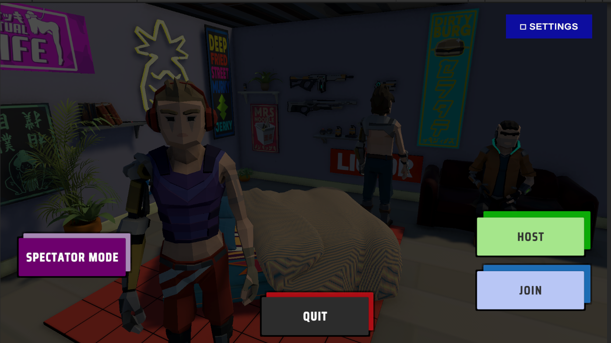
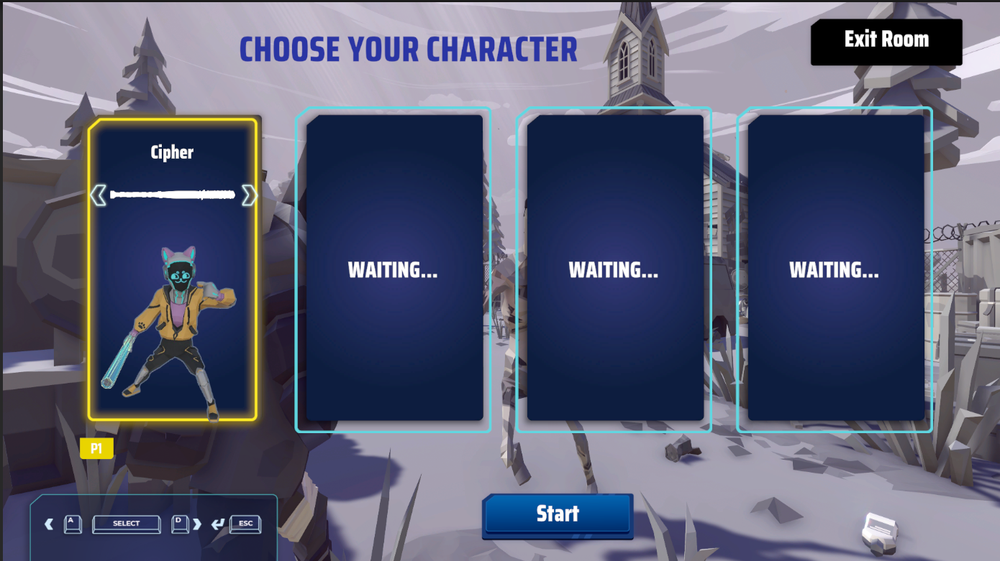
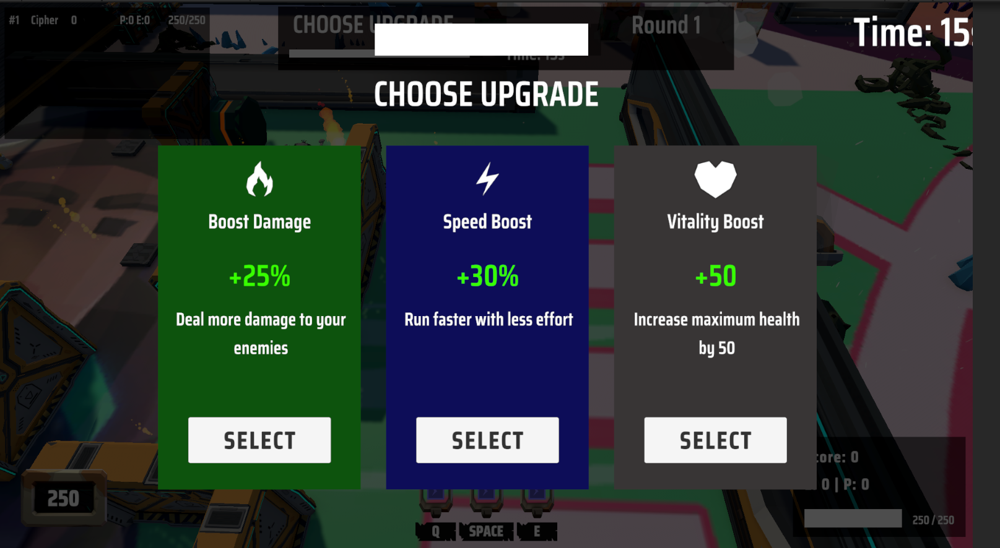
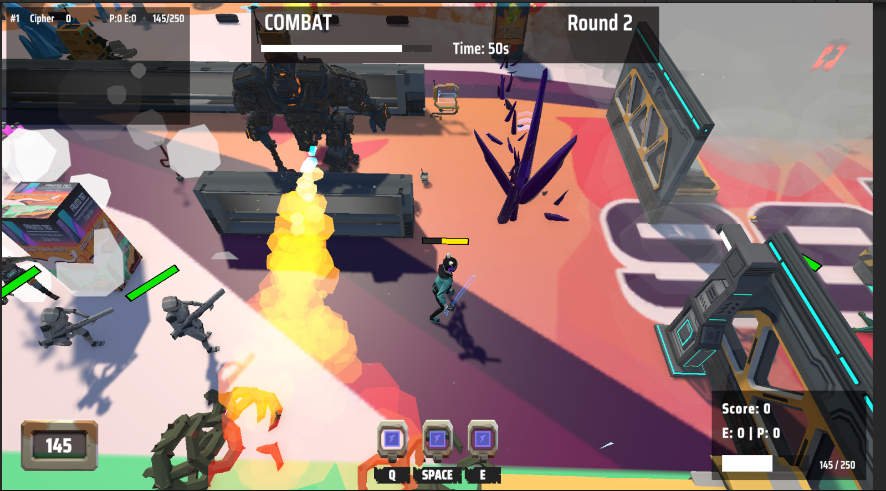
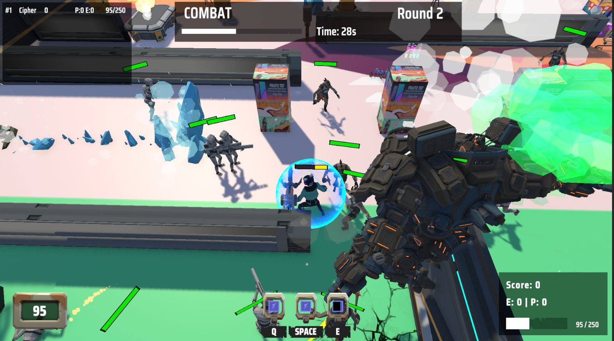

<p align="center">
  
</p>

<h1 align="center">🎮 Project-X</h1>

<p align="center">
  <strong>A Fast-Paced Multiplayer Roguelike Arena Game</strong>
</p>

<p align="center">
  
  
  
  
</p>

<p align="center">
  <a href="#-features">Features</a> •
  <a href="#-gallery">Gallery</a> •
  <a href="#-architecture">Architecture</a> •
  <a href="#-getting-started">Getting Started</a> •
  <a href="#-controls">Controls</a>
</p>

---

## 📖 About

**Project-X** is a fast-paced roguelike battle arena game featuring intense PvPvE combat. Battle against waves of enemies, collect powerful upgrades, and compete against other players in a shrinking arena. Built with Unity and Unity Netcode for GameObjects (NGO) for seamless multiplayer experience.

### 🎯 Game Modes

| Mode | Description |
|------|-------------|
| **Solo** | Battle through waves of enemies and bosses with AI companions |
| **Co-op Multiplayer** | Team up with friends to survive increasingly difficult waves |
| **PvPvE Arena** | Compete against other players while enemies add chaos to the battlefield |
| **Spectator** | Watch live matches with free camera or follow specific players |

---

## ✨ Features

### 🎮 Core Gameplay
- ⚔️ **Fast-paced Combat** - Fluid movement and responsive attack systems
- 🎲 **Roguelike Upgrades** - Choose from randomized upgrades between waves
- 👹 **Dynamic Enemies** - Smart AI with chase, patrol, and attack behaviors
- 🏆 **Boss Battles** - Epic encounters with unique mechanics
- 🌍 **Shrinking Arena** - Battle royale-style zone that forces intense encounters

### 🌐 Multiplayer
- 🔗 **Seamless Networking** - Built on Unity Netcode for GameObjects
- 👥 **Up to 4 Players** - Cooperative or competitive multiplayer
- 📺 **Spectator Mode** - Watch matches with free camera or player follow
- 🔒 **Server Authority** - Cheat-resistant server-authoritative gameplay

### 🎨 Polish
- 🎵 **Dynamic Audio** - Immersive sound effects and music
- ⚙️ **Settings System** - Customizable volume, graphics quality, and display options
- 🎭 **Character Selection** - Multiple unique heroes to choose from
- ✨ **Visual Effects** - Stunning VFX powered by Unity's particle system

---

## 🖼️ Gallery

### Main Menu
<p align="center">
  
</p>

### Character Selection
<p align="center">
  
</p>

### Gameplay
<p align="center">
  
  
</p>

<p align="center">
  
</p>

---

## 🚀 Getting Started

### Prerequisites

- **Unity 6000.0.23f1** or later (Unity 6)
- **Netcode for GameObjects** package
- Windows 10/11

### Installation

1. **Clone the repository**
   ```bash
   git clone https://github.com/khoido2003/Project-X.git
   ```

2. **Open in Unity Hub**
   - Add the project folder
   - Open with Unity 6000.0.23f1+

3. **Open the Main Menu scene**
   ```
   Assets/Scenes/MainMenu.unity
   ```

4. **Play!**
   - Click **Host** to start a match
   - Or click **Join** and enter an IP to join a friend

---

## 🎮 Controls

| Action | Key |
|--------|-----|
| **Move** | WASD |
| **Attack** | Left Mouse Button |
| **Skill 1** | Q |
| **Skill 2** | E |
| **Ultimate** | R |
| **Dash** | Space |
| **Pause Menu** | Escape |

### Spectator Mode

| Action | Key |
|--------|-----|
| **Free Look** | Right Click + Mouse |
| **Move Camera** | WASD |
| **Speed Boost** | Shift |
| **Switch Mode** | Tab |
| **Cycle Players** | Q / E |

---

## 🔧 Configuration

### Graphics Quality Presets

| Setting | Low | Medium | High |
|---------|-----|--------|------|
| Shadows | Off | Hard | Soft |
| Textures | 1/4 | 1/2 | Full |
| Anti-Aliasing | Off | 2x | 4x |
| Effects | Minimal | Standard | Full |

Settings are automatically saved and persist between sessions.

---

## 📄 License

This project is licensed under the MIT License - see the [LICENSE](LICENSE) file for details.

---

# 📚 Development Documentation

## Git Workflow (Team Rules)

### 1. Branch Rules
- **`main`**
  - Always stable, production-ready.
  - Only updated via **Pull Requests (PRs)**.
  - Protected branch (no direct commits).

- **Feature branches (`dev_xxx`)**
  - Created from the latest `main`.
  - One branch per feature/bugfix.
  - Deleted after merge.

---

### 2. Starting New Work
Always branch off the latest `main`:

```bash
git checkout main
git pull origin main
git checkout -b dev_featureName
```

---

### 3. While Working
- Commit often with clear messages.
- Push to remote frequently.
- Open a Pull Request early (for visibility).

---

### 4. Syncing With Main (Avoiding Conflicts)
If your branch is behind `main`:

```bash
git checkout main
git pull origin main
git checkout dev_featureName
git rebase main   # or merge --ff-only if you prefer
```

Resolve conflicts **only once** here → not at PR merge.

---

### 5. Merging PRs
On GitHub:
- Use **Rebase and Merge** for clean history.
- Never "Create a merge commit" (avoids messy trees).
- Never push directly to `main`.

---

### 6. After Merge
⚠️ Important: Do **not** keep working in the old feature branch after it's merged.
Instead, reset or start fresh:

```bash
# If you want to reuse the same branch:
git checkout dev_featureName
git fetch origin
git reset --hard origin/main

# OR (preferred) delete and recreate:
git branch -D dev_featureName
git checkout -b dev_newFeature origin/main
```

This avoids duplicate commits + random conflicts.

---

### 7. Quick Commands (Cheat Sheet)

```bash
# Update main
git checkout main
git pull origin main

# Start new feature branch
git checkout -b dev_feature origin/main

# Sync feature with main
git checkout main
git pull origin main
git checkout dev_feature
git rebase main

# Save WIP before reset
git stash push -m "WIP"
git reset --hard origin/main
git stash pop
```

---

## 🏗️ Architecture

### Overview

Project-X uses a **custom ECS-inspired architecture** built on classic Unity (not DOTS). This approach cleanly separates data, logic, and presentation while maintaining full Unity compatibility and enabling seamless multiplayer support.

| Layer | Responsibility | Examples |
|-------|----------------|----------|
| **Components** | Pure data containers (no logic) | `HealthDataComponent`, `MovementDataComponent` |
| **Systems** | Game logic operating on components | `DamageSystem`, `SkillSystem` |
| **Views** | Unity MonoBehaviour integration | `EntityView`, `AnimationView` |
| **Services** | Singleton utilities | `AudioService`, `InputService` |
| **Events** | Decoupled communication | `DamageEvent`, `EntityDeathEvent` |

---

### Core ECS Framework

```
┌──────────────────────────────────────────────────────────────┐
│                          WORLD                                │
│  The central container managing all game state                │
├──────────────────────────────────────────────────────────────┤
│                                                                │
│  ┌─────────────┐   ┌──────────────┐   ┌─────────────────┐    │
│  │ EntityMgr   │   │ ComponentStore│  │  SystemManager  │    │
│  │             │   │               │   │                 │    │
│  │ • Create    │   │ • Add/Remove │   │ • Register      │    │
│  │ • Destroy   │   │ • Query      │   │ • Update Loop   │    │
│  │ • Track IDs │   │ • Type-safe  │   │ • Priority      │    │
│  └─────────────┘   └──────────────┘   └─────────────────┘    │
│         │                 │                    │              │
│         └─────────────────┼────────────────────┘              │
│                           ▼                                    │
│  ┌─────────────────────────────────────────────────────┐     │
│  │                   EVENT BUS                          │     │
│  │  Publish/Subscribe pattern for decoupled messaging   │     │
│  └─────────────────────────────────────────────────────┘     │
│                           │                                    │
│  ┌─────────────────────────────────────────────────────┐     │
│  │               SERVICE CONTAINER                      │     │
│  │  Dependency injection for Input, Audio, Time, etc.   │     │
│  └─────────────────────────────────────────────────────┘     │
│                                                                │
└──────────────────────────────────────────────────────────────┘
```

---

### ECS Components (Data Layer)

Components are **pure data containers** with no logic. They are stored in `ComponentStore` and queried by systems.

| Component | Description | Key Fields |
|-----------|-------------|------------|
| `TransformDataComponent` | Position/rotation in world space | `Position`, `Rotation`, `Scale` |
| `MovementDataComponent` | Movement state and parameters | `Velocity`, `MoveSpeed`, `IsStunned`, `KnockbackVelocity` |
| `HealthDataComponent` | Health and damage state | `CurrentHealth`, `MaxHealth`, `IsDead`, `IsInvincible` |
| `AttackDataComponent` | Attack timing and state | `AttackDamage`, `AttackRange`, `AttackCooldown`, `IsAttacking` |
| `CombatStateComponent` | Current combat action | `CurrentState` (Idle/Attacking/Casting/Stunned) |
| `SkillSetComponent` | Available skills and cooldowns | `Skills[]`, `Cooldowns[]`, `IsChanneling` |
| `WeaponDataComponent` | Equipped weapon stats | `WeaponType`, `BaseDamage`, `AttackSpeed` |
| `EnemyComponent` | Enemy AI configuration | `AIState`, `DetectionRange`, `AttackRange`, `PatrolRadius` |
| `BossComponent` | Boss-specific data | `Phase`, `SpecialAttacks[]`, `EnrageThreshold` |
| `AnimationDataComponent` | Animation state | `IsMoving`, `MoveX`, `MoveY`, `TriggerAttack` |
| `NetworkOwnerComponent` | Network ownership | `ClientId`, `IsLocalPlayer` |

---

### ECS Systems (Logic Layer)

Systems contain **pure game logic** and operate on entities with specific component combinations. They run in priority order each frame.

#### Core Gameplay Systems

| System | Description | Components Used |
|--------|-------------|-----------------|
| `InputSystem` | Captures player input, fires input events | `MovementDataComponent`, `PlayerTagComponent` |
| `MovementSystem` | Applies velocity, handles collision | `TransformDataComponent`, `MovementDataComponent` |
| `AttackSystem` | Processes attack actions, timing | `AttackDataComponent`, `CombatStateComponent` |
| `SkillSystem` | Manages skill casting, cooldowns | `SkillSetComponent`, `CombatStateComponent` |
| `DamageSystem` | Calculates and applies damage | `HealthDataComponent`, `AttackDataComponent` |
| `HealthSystem` | Monitors health, triggers death | `HealthDataComponent` |
| `HealthRegenSystem` | Regenerates health over time | `HealthDataComponent` |
| `CombatStateSystem` | Manages combat state transitions | `CombatStateComponent` |
| `StunSystem` | Handles stun duration and recovery | `MovementDataComponent`, `CombatStateComponent` |
| `KnockbackSystem` | Applies knockback velocity decay | `MovementDataComponent` |

#### Enemy AI Systems

| System | Description |
|--------|-------------|
| `EnemyAISystem` | State machine controller (Idle → Chase → Attack) |
| `EnemyVisionSystem` | Detects players, manages aggro targets |
| `EnemyMovementSystem` | Pathfinding, obstacle avoidance, patrol behavior |
| `EnemyPathfindingSystem` | A* pathfinding integration |

#### Support Systems

| System | Description |
|--------|-------------|
| `SpawnSystem` | Entity instantiation from prefabs |
| `PlayerRespawnSystem` | Death handling and respawn logic |
| `CameraFollowSystem` | Camera tracking of local player |
| `TransformSyncSystem` | Syncs ECS transform to Unity Transform |
| `AudioSystem` | Processes audio events |
| `AudioProfileSystem` | Manages entity-specific audio settings |

---

### Views (Presentation Layer)

Views are **MonoBehaviours** that bridge ECS data to Unity's visual/audio systems.

| View | Description |
|------|-------------|
| `EntityView` | Base view with entity reference, binds GameObject to EntityId |
| `AnimationView` | Subscribes to animation events, controls Animator |
| `AudioProfileView` | Plays entity-specific sound effects |
| `HealthBarView` | Updates health bar UI |
| `SkillIndicatorView` | Shows skill range/targeting previews |
| `ProjectileView` | Projectile movement and hit detection visualization |
| `NetworkSyncView` | Server-authoritative state synchronization (2000+ lines) |

---

### Services (Infrastructure Layer)

Services provide **global utilities** via dependency injection.

| Service | Description |
|---------|-------------|
| `AudioService` | Sound effect and music playback, volume control |
| `InputService` | Abstracted input with action mapping |
| `TimeService` | Game time, pause support |
| `SettingsManager` | Player settings persistence (audio, graphics, display) |
| `EntityViewRegistry` | Maps EntityId ↔ GameObject |

---

### Event System

The game uses a **publish/subscribe event bus** for decoupled communication.

| Event | Published By | Consumed By |
|-------|--------------|-------------|
| `DamageEvent` | `DamageSystem` | `HealthSystem`, `VFXController`, `AudioSystem` |
| `EntityDeathEvent` | `HealthSystem` | `SpawnSystem`, `ScoreSystem`, `AnimationView` |
| `SkillCastEvent` | `SkillSystem` | `ProjectileSpawner`, `VFXController`, `AudioSystem` |
| `AnimationParameterEvent` | Various systems | `AnimationView` |
| `PlaySoundEvent` | Various systems | `AudioSystem` |
| `InputEvent` | `InputSystem` | `MovementSystem`, `AttackSystem`, `SkillSystem` |

---

### Network Architecture

#### Server-Authoritative Model

```
┌─────────────────────────────────────────────────────────────┐
│                    LOCAL PLAYER CLIENT                       │
├─────────────────────────────────────────────────────────────┤
│  1. InputSystem → Capture WASD, Mouse, Skills               │
│  2. Client-Side Prediction → Immediate movement response    │
│  3. NetworkSyncView.SendInputToServerRpc() → Send to server │
│  4. ← Receive authoritative state from server               │
│  5. Reconciliation → Correct if prediction diverges         │
└─────────────────────────────────────────────────────────────┘
                              │
                              ▼ RPC
┌─────────────────────────────────────────────────────────────┐
│                          SERVER                              │
├─────────────────────────────────────────────────────────────┤
│  1. Receive input from all clients                          │
│  2. Validate inputs (anti-cheat)                            │
│  3. Run authoritative ECS systems:                          │
│     • MovementSystem (physics, collision)                   │
│     • AttackSystem (hit detection, damage)                  │
│     • SkillSystem (cooldowns, effects)                      │
│     • DamageSystem (damage calculation)                     │
│     • HealthSystem (death, respawn)                         │
│  4. Broadcast state via NetworkVariables + RPCs             │
└─────────────────────────────────────────────────────────────┘
                              │
                              ▼ Sync
┌─────────────────────────────────────────────────────────────┐
│                    REMOTE PLAYER CLIENT                      │
├─────────────────────────────────────────────────────────────┤
│  1. Receive state updates (position, health, animations)    │
│  2. Interpolate between states for smooth rendering         │
│  3. Play animations and effects based on state changes      │
│  4. No prediction - pure server state rendering             │
└─────────────────────────────────────────────────────────────┘
```

#### Sync Strategy by Component

| Component | Sync Method | Frequency | Notes |
|-----------|-------------|-----------|-------|
| Transform | NetworkVariable + Interpolation | 60 Hz | Client prediction for owner |
| Health | NetworkVariable | On Change | Server authority only |
| Movement | Input RPC → State Sync | Every tick | Predicted on owner client |
| Attack | Event RPC | On Action | Animation predicted locally |
| Skills | Cooldown RPC | On Cast | Preview on owner only |
| Animation | Parameter RPC | On Change | Synced for visual consistency |
| Combat State | NetworkVariable | On Change | Read by all clients |

#### System Authority Matrix

| System | Server | Client (Owner) | Client (Remote) |
|--------|--------|----------------|-----------------|
| `InputSystem` | ❌ | ✅ Capture | ❌ |
| `MovementSystem` | ✅ Authority | ✅ Predict | ❌ |
| `AttackSystem` | ✅ Authority | ✅ Predict Anim | ❌ |
| `DamageSystem` | ✅ Only | ❌ | ❌ |
| `HealthSystem` | ✅ Only | ❌ | ❌ |
| `SkillSystem` | ✅ Authority | ✅ Preview | ❌ |
| `EnemyAISystem` | ✅ Only | ❌ | ❌ |
| `SpawnSystem` | ✅ Only | ❌ | ❌ |

---

### Project Structure

```
Assets/Scripts/
├── Core/                      # Core framework and managers
│   ├── ECS/                   # Custom ECS implementation
│   │   ├── World.cs           # Central container
│   │   ├── EntityId.cs        # Entity identifier
│   │   ├── ComponentStore.cs  # Component storage
│   │   ├── SystemBase.cs      # Base system class
│   │   └── SystemManager.cs   # System execution
│   ├── Managers/              # Game managers
│   │   ├── NetworkGameStateManager.cs
│   │   ├── NetworkUpgradeSystem.cs
│   │   └── SettingsManager.cs
│   ├── Network/               # Networking utilities
│   └── Spectator/             # Spectator mode
│
├── ECS/                       # ECS game implementation
│   ├── Components/            # 16 pure data components
│   ├── Systems/               # 20 game logic systems
│   ├── Views/                 # 25 MonoBehaviour views
│   ├── Services/              # Audio, Input services
│   ├── Events/                # 12 event types
│   ├── AI/                    # Enemy AI
│   ├── Factories/             # Entity creation
│   ├── Helpers/               # Utility classes
│   └── Interfaces/            # Service interfaces
│
├── SO/                        # ScriptableObject assets
│   ├── Characters/            # Character definitions
│   ├── Weapons/               # Weapon stats
│   ├── Skills/                # Skill configurations
│   ├── Enemies/               # Enemy data
│   └── Audio/                 # Audio profiles
│
├── UI/                        # UI controllers
│   ├── GameWorldUI/           # In-game HUD
│   ├── Spectator/             # Spectator UI
│   └── Settings/              # Settings panel
│
└── Editor/                    # Editor tools
    ├── SettingsUICreator.cs
    └── SpectatorCameraRigCreator.cs
```

---

<p align="center">
  Made with ❤️ and Unity
</p>

<p align="center">
  <a href="#-project-x">Back to Top ↑</a>
</p>
